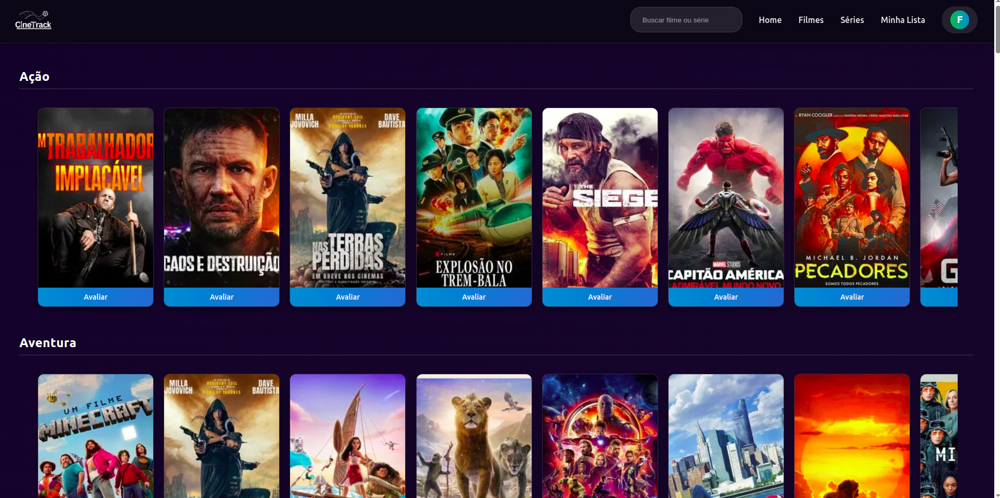
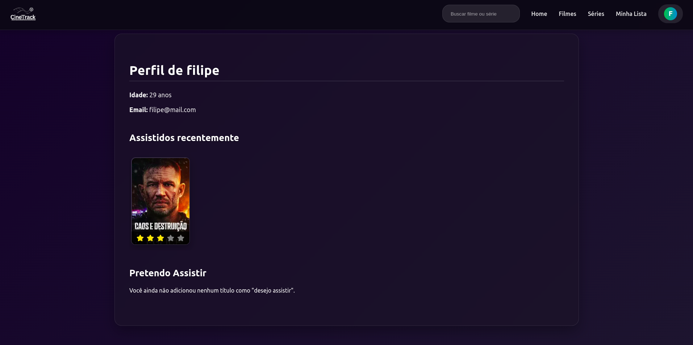

# 🎬 CineTrack - Sua Rede Social de Filmes

[](https://app.netlify.com/sites/cinetrack-pas/deploys)
[](LICENSE)

<p align="center" style="background-color:black; padding:20px;">
  
</p>

## ✨ Visão Geral

CineTrack é uma rede social para cinéfilos desenvolvida como projeto para a disciplina de Projeto Avançado de Software. Inspirado no Letterboxd, nosso aplicativo permite:

- 📝 Registrar e avaliar filmes assistidos
- 🎞 Criar listas temáticas
- 👥 Seguir amigos e ver suas atividades
- 🔍 Descobrir novos filmes através da comunidade

**Acesse agora:** [cinetrack-pas.netlify.app/login](https://cinetrack-pas.netlify.app/login)

## 🖥 Screenshots

| Login | Dashboard | Perfil |
|-------|-----------|--------|
|  |  |  |

## 🛠 Tecnologias Utilizadas

### Frontend
- 
- 
- 
- 

### Deploy
- 

## 🚀 Como Executar Localmente

1. Clone o repositório:
   ```bash
   git clone https://github.com/seu-usuario/cinetrack.git
   cd cinetrack
   ```

2. Instale as dependências:
   ```bash
   npm install
   ```

3. Inicie o servidor de desenvolvimento:
   ```bash
   npm run dev
   ```

4. Acesse no navegador:
   ```
   http://localhost:5173
   ```

## 📝 Funcionalidades Principais

- ✅ Autenticação de usuários
- ✅ CRUD completo de avaliações de filmes
- ✅ Sistema de seguidores/seguindo
- ✅ Feed de atividades
- ✅ Listas personalizadas
- ✅ Busca de filmes
- ✅ Perfil personalizável

## 🤝 Contribuidores

Agradecimentos especiais aos incríveis colaboradores deste projeto:

- [**Bruno Souza**](https://github.com/BruninSouza) - Colaborador
- [**Pedro Miguel**](https://github.com/PedroPsy) - Colaborador

## 🤝 Contribuição

Contribuições são bem-vindas! Para contribuir:

1. Faça um fork do projeto
2. Crie uma branch para sua feature (`git checkout -b feature/NomeDaFeature`)
3. Commit suas alterações (`git commit -m 'Adiciona nova feature'`)
4. Push para a branch (`git push origin feature/NomeDaFeature`)
5. Abra um Pull Request

## 📄 Licença

Distribuído sob licença MIT. Consulte o arquivo [LICENSE](LICENSE) para mais informações.

Link do Projeto: [https://github.com/filipelimavaz/cinetrack](https://github.com/filipelimavaz/cinetrack)